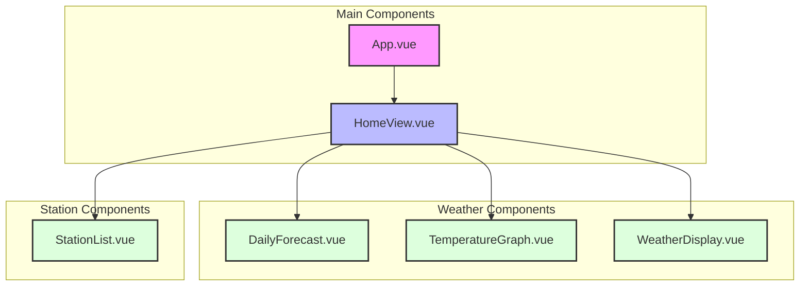

# Component Hierarchy

## Component Descriptions

### Main Components
- **App.vue**: Root component that provides the main layout and routing
- **HomeView.vue**: Main view component that orchestrates the weather display

### Weather Components
- **DailyForecast.vue**: Displays daily weather forecasts
- **TemperatureGraph.vue**: Shows temperature trends over time
- **WeatherDisplay.vue**: Displays current weather conditions

### Station Components
- **StationList.vue**: Manages the list of weather stations and station selection 